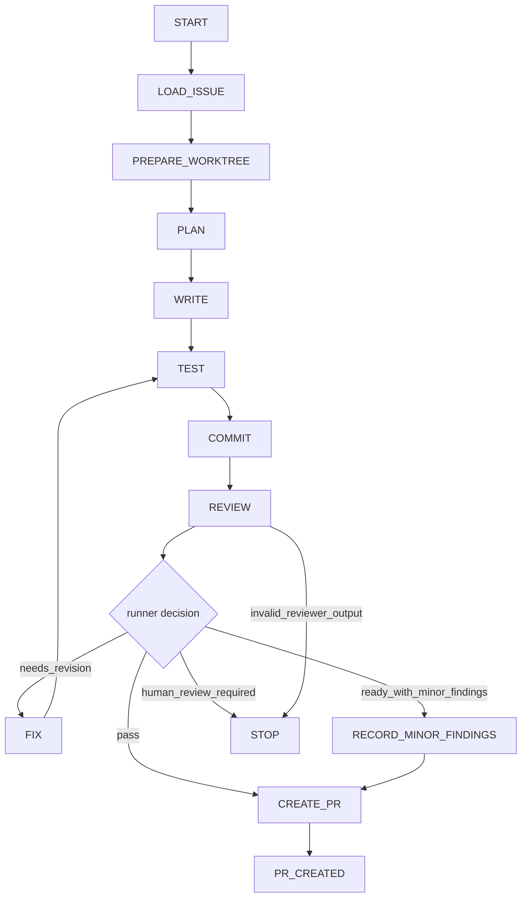
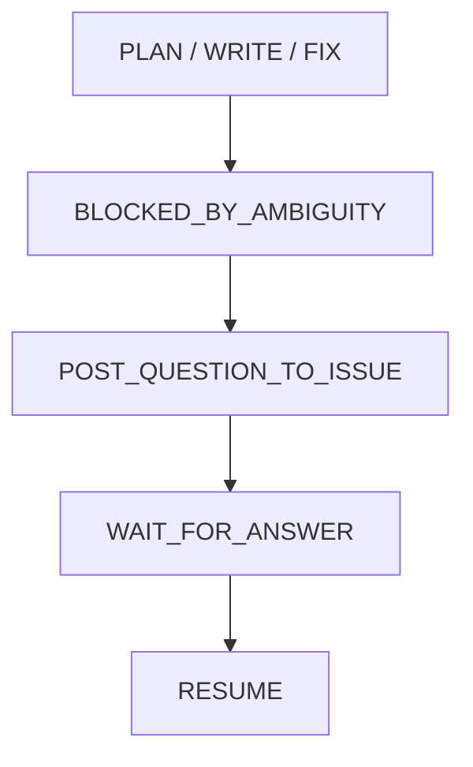
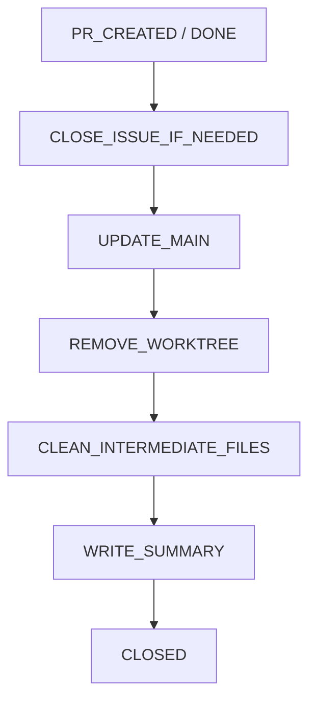

# ドメインモデル

## 概要

Kogoto は、GitHub Issue を一枚の「作業札」とみなし、writer agent・reviewer agent・人間の確認を往復させながらIssue解決を支援するrunnerである。

Kogotoは自律開発ツールではない。Issueを単位として小さく作業を進め、必要な箇所で人間が確認・回答・停止できるようにすることを目的とする。

---

## 用語

### Kogoto

Issue を一枚の作業単位とみなし、writer agent・reviewer agent・人間の確認を往復させながらIssue解決を支援するrunner。

CLI コマンド名は `kogoto`。

### Run

`kogoto resolve <issue-number>` によって開始される一連の作業単位。

1つのRunには以下が紐づく:

| 要素 | 説明 |
|------|------|
| Issue番号 | 対象のGitHub Issue |
| worktree | Issue専用の作業ディレクトリ |
| branch | Issue専用のGitブランチ |
| writer | 変更を書くagent |
| reviewer | 変更を検査するagent |
| review loop | 修正・再レビューの繰り返し |
| PR | 作成されたPull Request |
| ログ | 作業の中間記録 |
| 状態 | Runのライフサイクル状態 |

### Writer

Issueに基づいて変更を書くagent。

writerは、コード実装だけでなく、ドキュメント、設定、テスト、CI、その他リポジトリ内成果物の変更も扱う。そのため `implementer` や `main-agent` ではなく `writer` と呼ぶ。

writerは不明点・曖昧点があれば推測で進めず、blocked状態を構造化して返す。

### Reviewer

writerが作成した変更を検査するagent。

reviewerは、差分・テスト結果・Issueの受け入れ基準・scope逸脱・設計上の問題を確認する。reviewerは原則として変更を書かず、指摘を構造化して返す。

### Worktree

Issue専用の作業ディレクトリ。メインリポジトリとは分離された環境で作業を行う。

```
{worktree_root}/{repo_name}-issue-{issue_number}
```

例:

```
~/src/kogoto-worktrees/kogoto-issue-7
```

専用branchを持つ:

```
branch: kogoto/issue-7
```

---

## Run の状態遷移

### 通常フロー



### blocked フロー（不明点あり）



### 終了処理フロー（`kogoto close`）



---

## Blocked 状態

作業中に不明点・曖昧点が出た場合、writerは推測で進めてはならない。

writerはblocked状態を構造化して返す:

```json
{
  "status": "blocked",
  "reason": "acceptance criteria are ambiguous",
  "questions": [
    {
      "id": "q1",
      "question": "Should Kogoto create a PR automatically, or only generate a PR body?",
      "blocking": true
    }
  ]
}
```

Kogotoはこれを検出したら、Issueに質問コメントを投稿して停止する。

### 回答とみなすもの

* Kogotoの質問コメント投稿後に追加されたIssueコメント
* Kogoto自身の投稿ではないコメント
* bot投稿ではないコメント
* `kogoto answer` で投稿されたコメント

### 回答とみなさないもの

* Kogoto自身の状態コメント
* GitHub Actions bot / Copilot bot等の自動コメント
* 質問コメントより前のコメント
* `kogoto:` markerを含むKogoto管理コメント

---

## Reviewer の出力モデル

### pass の場合

```json
{
  "status": "pass",
  "findings": [],
  "human_review_required": []
}
```

### 指摘がある場合

```json
{
  "status": "needs_fix",
  "findings": [
    {
      "id": "r1",
      "severity": "blocking",
      "category": "bug",
      "file": "src/runner.ts",
      "line": 120,
      "message": "The runner may treat its own comment as a user answer.",
      "required_fix": "Ignore comments authored by the configured GitHub actor and comments containing kogoto markers."
    }
  ],
  "human_review_required": []
}
```

### severity

| 値 | 意味 |
|----|------|
| `blocking` | 修正必須。修正ループに入る |
| `major` | 重大。修正ループに入る |
| `minor` | 軽微。設定により扱いを変える |

### category

| 値 | 意味 |
|----|------|
| `bug` | バグ |
| `test` | テスト |
| `scope` | スコープ逸脱 |
| `design` | 設計問題 |
| `security` | セキュリティ |
| `docs` | ドキュメント |
| `style` | スタイル |
| `maintainability` | 保守性 |
| `other` | その他 |

### 判定ルール

v0では、runnerはreviewerの `status` だけで状態遷移を決めない。
reviewer出力を正規化し、findingsのseverityと `human_review_required` からrunner decisionを導出する。

| 条件 | runner decision | v0の遷移 |
|------|-----------------|----------|
| `findings` が空 | `pass` | PR作成に進む |
| `minor` findingsのみ | `ready_with_minor_findings` | PR作成に進み、minor findingsをPR本文とrun summaryに記録する |
| `blocking` または `major` findingsがある | `needs_revision` | 修正ループに入る |
| `human_review_required` が空でない | `human_review_required` | 停止して人間確認を求める |
| reviewer出力が不正 | なし | `run_state = failed` + `last_error.code = invalid_reviewer_output` で停止する |

`minor` findingsは、v0デフォルトでは修正ループを起動しない。
設定例の `minor_policy = "comment-only"` はこの挙動を表す。

reviewerの `status` とfindingsが矛盾する場合も、runnerは正規化後のfindingsから遷移を決める。

```txt
reviewer status = "needs_fix" かつ findings は minor のみ
→ ready_with_minor_findings
→ PR作成へ進み、minor findingsを記録する

reviewer status = "pass" かつ findings に major が含まれる
→ needs_revision
→ 修正ループに入る
```

---

## 修正ループ

修正ループには上限を設ける。

初期値:

```
max_review_loops = 3
```

### 自動継続してよいもの

* test失敗の修正
* lint失敗の修正
* typecheck失敗の修正
* reviewerのblocking / major指摘への対応
* Issue受け入れ基準に対する明らかな作業漏れ

### 停止して人間確認に戻すもの

* Issue scopeを変える必要がある
* 受け入れ基準が矛盾している
* 仕様判断が必要
* public APIの破壊的変更が必要
* 設計方針の変更が必要
* `max_review_loops` に到達した
* agentが解決不能と判断した
* blocked questionsが発生した

### v0 テストケース

runner decisionの最低限のテストケース:

```txt
no findings
→ create PR

only minor findings, default policy
→ create PR with minor findings recorded

major finding
→ enter revision loop

blocking finding
→ enter revision loop

minor + major findings
→ enter revision loop

human_review_required present
→ stop as human-review-required

invalid reviewer JSON
→ stop as invalid-review-output

reviewer status = "needs_fix" but findings are only minor
→ create PR with minor findings recorded

reviewer status = "pass" but findings contain major
→ enter revision loop

reviewer status = "pass" but human_review_required is non-empty
→ stop
```

---

## Commit 戦略

v0では、checkpoint commit方式を採用する。

```
commit 1: resolve issue #7
commit 2: address review findings round 1
commit 3: address review findings round 2
```

設定:

```toml
[commit]
strategy = "checkpoint"
```

将来候補:

```toml
[commit]
strategy = "squash-before-pr"
```

---

## パッケージ構成

```
cmd/
  kogoto/
    main.go          # CLIエントリポイント

internal/
  app/               # ユースケース層。各サブコマンドのロジックを束ねる
  config/            # 設定の読み込み・管理
  tracker/           # Issue Tracker の抽象層（インタフェース・ドメイン型）
    github/          # tracker.Tracker の GitHub 実装
  git/               # Git 操作（worktree の作成・切り替えなど）
  agent/             # エージェントアダプタ（writer / reviewer の起動と通信）
  runner/            # Kogoto 実行ライフサイクルの管理
  state/             # 実行状態の永続化・読み込み
  shell/             # 外部プロセス実行のユーティリティ
```

### 依存の方向

```
app → runner → tracker, git, agent, state → tracker/github, shell, config
```

上位層（`app`, `runner`）は抽象（`tracker`）にのみ依存し、実装（`tracker/github`）を直接参照しない。具体的な実装への依存は `app` または `cmd/kogoto` でインジェクションする。

---

## 安全制約

v0から必須とする制約:

* main branchへ直接pushしない
* mergeしない
* 作業はworktree内で行う
* secrets / `.env` を読ませない
* destructive commandを制限する
* 作業branch prefixを固定する
* `max_review_loops` を必須にする
* 不明点があれば推測で進めずblockedにする
* Issue scope外変更をreview findingとして扱う
* 既存の未commit変更がある場合は開始しない、または明示確認する
* 既存worktreeがある場合は上書きしない
* `close` 時はPR未merge・未commit変更・未push commitがある場合に停止する
* `close` はsummaryを残して詳細中間ファイルだけを削除する
