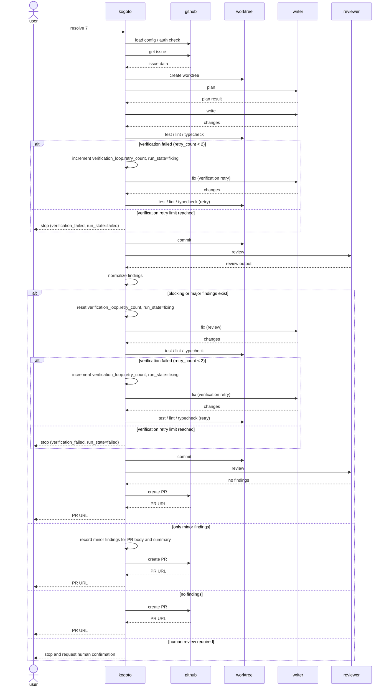
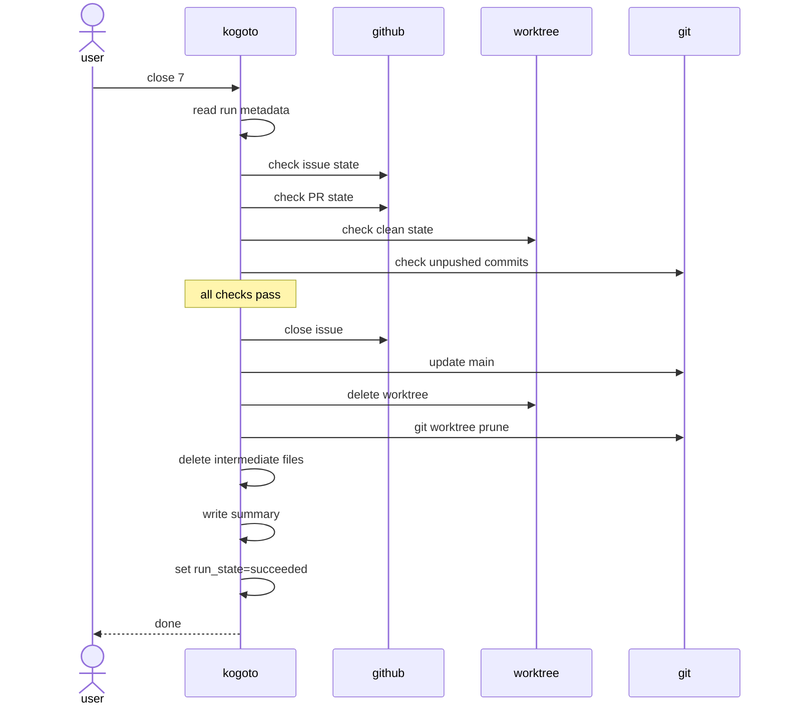
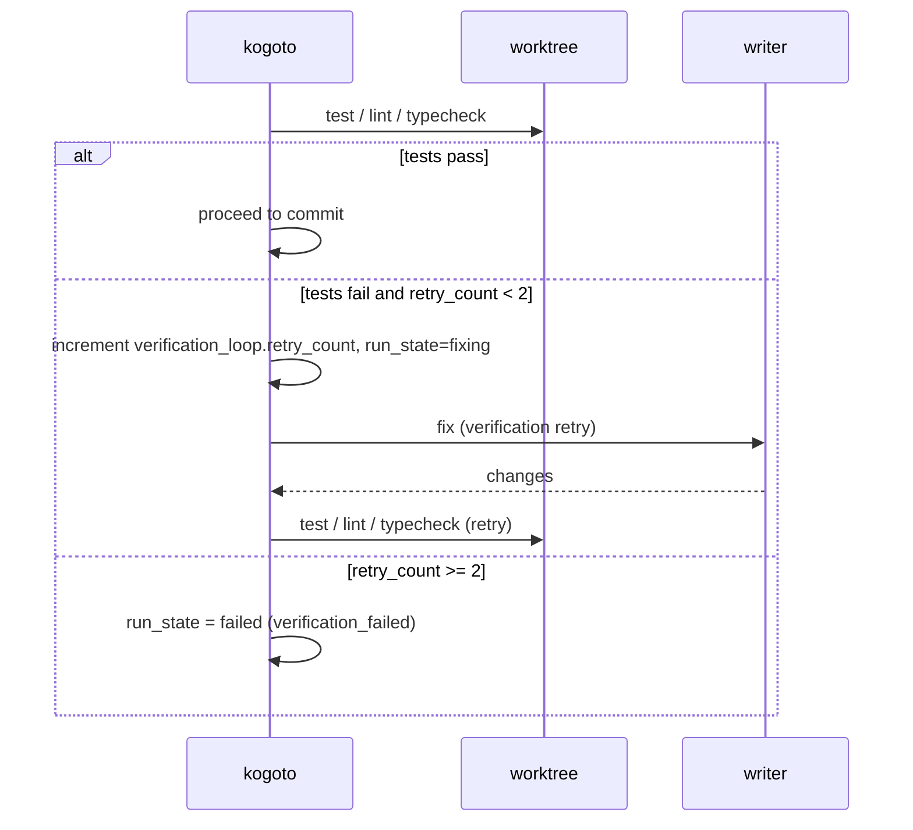
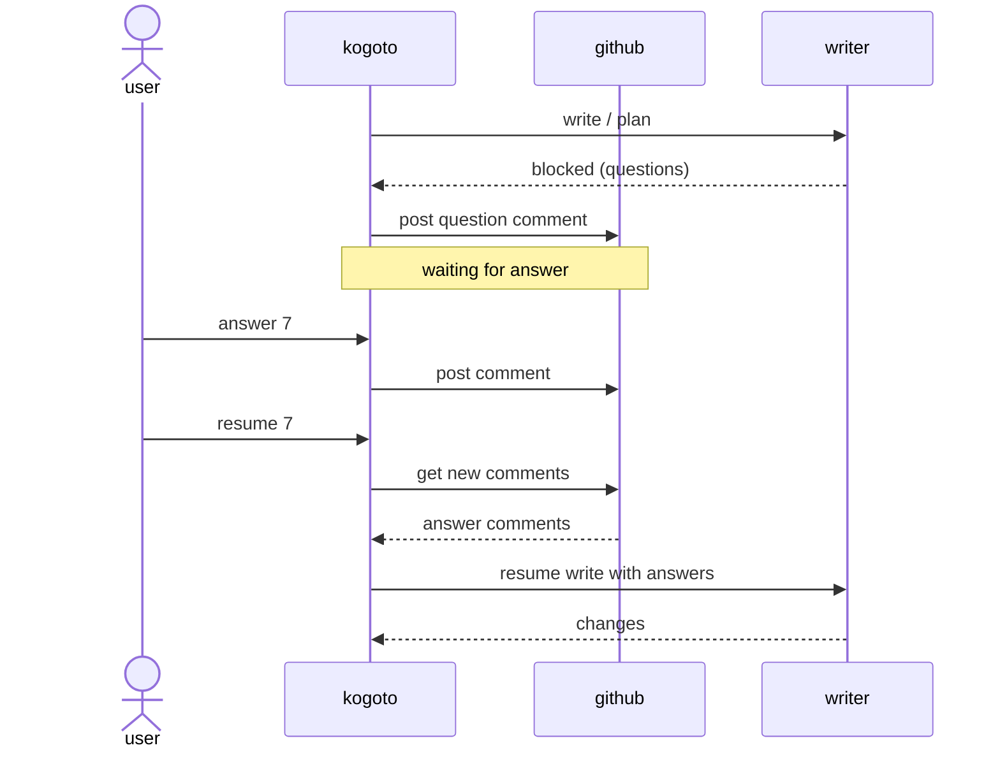

# 処理シーケンス

## `kogoto resolve <issue-number>` の処理フロー

```bash
kogoto resolve 7
```

### ステップ

```
1.  設定を読み込む
2.  GitHub認証を確認する
3.  対象repositoryを確認する
4.  Issue本文・Issueコメントを取得する
5.  runディレクトリを作成する
6.  mainを最新化する
7.  Issue専用worktreeを作成する
8.  writerにplanを作成させる
9.  planにblockedがあればIssueに質問コメントを投稿して停止する
10. writerに作業させる
11. test / lint / typecheck を実行する（verification loop: 失敗時は最大2回までwriterに修正依頼）
12. 変更をcommitする
13. reviewerに差分レビューさせる
14. reviewer出力を正規化してrunner decisionを決める
15. `blocking` / `major` findingsがあればwriterに修正させる
16. 修正後にtest / lint / typecheckを再実行する（verification loop: 失敗時は最大2回までwriterに修正依頼）
17. 修正をcommitする
18. reviewerに再レビューさせる
19. `blocking` / `major` findingsがなくなるまで15〜18を繰り返す
20. verificationが成功済みで、findingsがない、または `minor` findingsのみならPRを作成する
21. PR URLを表示する
22. run状態をpr-createdにする
```

v0ではrunnerの状態遷移をreviewerの `status` だけで決めない。
reviewer出力を正規化し、findingsのseverityと `human_review_required` からrunner decisionを導出する。

| reviewer出力 | runner decision | 遷移 |
|--------------|-----------------|------|
| findingsなし | `pass` | PR作成へ進む |
| `minor` findingsのみ | `ready_with_minor_findings` | PR作成へ進み、minor findingsをPR本文とrun summaryに記録する |
| `blocking` / `major` findingsあり | `needs_revision` | 修正ループに入る |
| `human_review_required` が空でない | `human_review_required` | v0では停止して人間確認を求める |
| reviewer JSONが不正 | `invalid_review_output` | 停止する |

### シーケンス図



---

## `kogoto close <issue-number>` の処理フロー

```bash
kogoto close 7
```

### 前提条件（安全条件）

`kogoto close` は、以下の状態の場合に停止する:

* 対応PRが存在しない
* 対応PRが未mergeである
* worktreeに未commit変更がある
* worktree branchに未push commitがある
* run状態が不明である
* 対象worktreeがKogoto管理下であることを確認できない

Issueが既にclosedの場合は、エラーにせずskipする。

### ステップ

```
1.  run metadataを読む
2.  対応Issueの状態を確認する
3.  対応PRの状態を確認する
4.  worktreeのclean状態を確認する
5.  未push commitがないか確認する
6.  Issueがopenならcloseする
7.  Issueがclosedならskipする
8.  mainを更新する
9.  対象worktreeを削除する
10. `git worktree prune` を実行する
11. 中間ファイルを削除する
12. summaryを保存する
13. run状態をsucceededにする
```

### シーケンス図



---

## Verification Loop

test / lint / typecheck の実行と結果による分岐を **verification loop** として定義する。

verification loop は review loop とは独立している。

- verification 成功（tests pass）: 次のフェーズ（commit）へ進む
- verification 失敗 and `verification_loop.retry_count < 2`: `retry_count` を加算して `run_state = fixing` を永続化し、writer に修正依頼後、verification を再実行する
- verification 失敗 and `verification_loop.retry_count >= 2`: PR を作成せず `run_state = failed` で停止する

`retry_count` は write / fix サイクルが新しく始まるたびに `0` にリセットする。v0 での上限は **2** に固定する（設定不可）。



---

## Blocked フロー

writerが不明点を検出した場合のシーケンス:



### Issueへの質問コメント形式

```markdown
<!-- kogoto:question run=<run-id> issue=7 question=q1 -->

## Kogoto blocked: clarification needed

作業中に次の不明点が見つかりました。

1. Should Kogoto create a PR automatically, or only generate a PR body?

このコメントへの返信、または `kogoto answer 7` で回答してください。
```

---

## Worktree 作成の処理

### 既存Worktreeの扱い

既存worktreeがある場合、Kogotoは勝手に上書きしない。

| run状態 | 扱い |
|---------|------|
| active | `resume` 候補として表示する |
| blocked | 回答待ちとして表示する |
| done / pr-created | `close` を促す |
| 状態不明 | 停止し、人間確認を求める |

### Worktree 命名規則

```
{worktree_root}/{repo_name}-issue-{issue_number}
```

例:

```
~/src/kogoto-worktrees/kogoto-issue-7
```

branch名:

```
kogoto/issue-7
```

---

## PR 作成

以下の条件をすべて満たした場合にのみ、KogotoはPRを作成する。

- verification が成功している（直近の test / lint / typecheck が pass している）
- `blocking` / `major` findings がない（`minor` findings のみ、またはなし）

`minor` findingsのみが残っている場合もPR作成へ進むが、PR本文とrun summaryに記録する。
`human_review_required` が空でない場合、v0ではPR作成へ進まず停止する。

PR本文の最低限の構成:

```markdown
## Summary

...

## Related Issue

Closes #7

## Verification

- [x] test command
- [x] lint command
- [x] typecheck command
- [x] Kogoto internal review: pass

## Kogoto Run

- writer: claude
- reviewer: claude/code-reviewer
- review loops: 2
- unresolved human review points: none
- minor findings: none
```

KogotoはPRを作成するが、mergeはしない。

---

## Issueコメントの状態管理

Kogotoが状態コメントを投稿する場合、Kogoto管理用markerを含める:

```markdown
<!-- kogoto:run-status issue=7 run=<run-id> -->

## Kogoto run status

Status: reviewing  
Worktree: kogoto-issue-7  
Branch: kogoto/issue-7  
Writer: claude  
Reviewer: claude/code-reviewer  
Review loop: 1/3
```

v0では新規コメント投稿のみ。将来的にはmarker付きコメントを検索し、同じ状態コメントを更新する。
