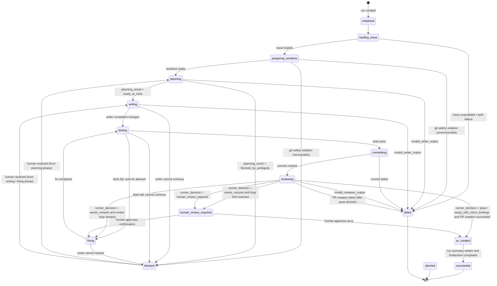

# Run State Machine

## Scope

このドキュメントは `run.json.run_state` の状態機械を定義する。

`status` という汎用フィールド名は使用しない。各ファイルの状態フィールドは次のように分離する。

| File | Field | Meaning |
|---|---|---|
| `run.json` | `run_state` | Run 全体のライフサイクル状態 |
| `plan.json` | `planning_result` | writer による計画段階の結果 |
| `review-N.json` | `reviewer_assessment` | reviewer が自己申告した評価。状態遷移の正本ではない |
| `review-N.json` | `runner_decision` | 正規化済み findings / human review request から runner が導出した制御判断 |
| `run-summary.json` | `terminal_state` | Run の終端分類 |
| `run-summary.json` | `completion_result` | 終端状態に至った具体的な結果・理由 |

---

## Persistent `run_state` Enum

`run.json.run_state` が取りうる値は次の通り。すべて lower snake case で固定する。

```
initialized
loading_issue
preparing_worktree
planning
blocked
writing
testing
committing
reviewing
fixing
human_review_required
pr_created
succeeded
aborted
failed
```

`closed` は `run_state` として使用しない。GitHub source issue / pull request の close 操作が将来必要な場合は、`source_issue_closed` など対象を明示する別の enum / event 名を使う。

---

## Conceptual State Mapping

概念状態と永続 `run_state` は分離する。概念状態は表示・分類用であり、永続化されない。

| Conceptual state | Persistent `run_state` values |
|---|---|
| initialized | `initialized` |
| active | `loading_issue`, `preparing_worktree`, `planning`, `writing`, `testing`, `committing`, `reviewing`, `fixing` |
| waiting for human | `blocked`, `human_review_required` |
| succeeded | `pr_created`, `succeeded` |
| terminated | `aborted`, `failed` |

`pr_created` は、PR 作成済みで `run.json.pull_request` に PR number / URL が記録済みの状態を表す。  
`succeeded` は、Fuda Run が正常終了し、必要な終了処理が完了した状態を表す。GitHub source issue が close 済みであることを意味しない。

---

## State Diagram



---

## State Transition Table

| From | Trigger | To | Notes |
|---|---|---|---|
| none | run created | `initialized` | `run.json` 作成 |
| `initialized` | start loading issue | `loading_issue` | Issue 本文・コメント取得 |
| `loading_issue` | issue loaded | `preparing_worktree` | Git 操作へ |
| `loading_issue` | issue unavailable / auth failure | `failed` | 復旧不能または要再実行 |
| `preparing_worktree` | worktree ready | `planning` | writer plan へ |
| `preparing_worktree` | git safety violation (recoverable) | `blocked` | Git 操作仕様に従う |
| `preparing_worktree` | git safety violation (unrecoverable) | `failed` | Git 操作仕様に従う |
| `planning` | `planning_result = ready_to_write` | `writing` | `plan.json` は正規化済み output |
| `planning` | `planning_result = blocked_by_ambiguity` | `blocked` | `blocked` object は `schemas/run.schema.json` を正とする |
| `planning` | plan output parse / validation / normalization failed | `failed` | `last_error.code = invalid_writer_output`。raw output は保存するが `plan.json` は書かない |
| `writing` | writer completed changes | `testing` | 変更後検証へ |
| `writing` | writer cannot continue | `blocked` | blocking question あり |
| `writing` | writer output invalid | `failed` | `last_error.code = invalid_writer_output`。agent output の parse / validation / normalization failure |
| `testing` | tests pass | `committing` | commit 前 diff 確認を含む |
| `testing` | tests fail and auto-fix allowed | `fixing` | writer に戻す |
| `testing` | tests fail and cannot continue | `blocked` | 人間判断待ち |
| `committing` | commit created | `reviewing` | reviewer へ |
| `committing` | commit failed | `failed` | Git 操作失敗 |
| `reviewing` | reviewer output parse / schema validation / normalization failed | `failed` | `last_error.code = invalid_reviewer_output`。`review-N.json` は書かない。`review-N.raw.txt` のみ保存 |
| `reviewing` | `runner_decision = pass` and PR creation succeeded | `pr_created` | `run.json.pull_request` に PR number / URL を記録する |
| `reviewing` | `runner_decision = ready_with_minor_findings` and PR creation succeeded | `pr_created` | minor findings は summary に残す |
| `reviewing` | PR creation failed after pass decision | `failed` | runner / GitHub API failure |
| `reviewing` | `runner_decision = needs_revision` and review loop remains | `fixing` | review loop 継続 |
| `reviewing` | `runner_decision = needs_revision` and review loop limit reached | `human_review_required` | `review_loop.completed_review_rounds >= max_rounds` |
| `reviewing` | `runner_decision = human_review_required` | `human_review_required` | 自動進行停止 |
| `fixing` | fix completed | `testing` | 再検証 |
| `fixing` | writer cannot resolve | `blocked` | blocking question あり |
| `pr_created` | run summary written and finalization completed | `succeeded` | Fuda Run の正常終了 |
| any non-terminal | user abort | `aborted` | 明示中断 |
| any non-terminal | unrecoverable runner / environment error | `failed` | runner / environment failure |
| `blocked` | human resolved questions | `planning` or `writing` | blocked reason に依存 |
| `human_review_required` | human approves continuation | `fixing` or `pr_created` | human decision に依存 |
| `succeeded` | — | terminal | 遷移不可 |
| `aborted` | — | terminal | 遷移不可 |
| `failed` | — | terminal by default | 明示 recover command がない限り遷移不可 |

---

## `runner_decision` Mapping

`reviewer_assessment` は状態遷移の正本ではない。`review-N.json.runner_decision` を、`reviewing` 後の遷移判断の正本とする。

`runner_decision = invalid_review_output` は使用しない。reviewer output の parse / schema validation / normalization に失敗した場合、`review-N.json` は書かず、`review-N.raw.txt` のみ保存し、`run_state = failed` + `last_error.code = invalid_reviewer_output` に遷移する。

`runner_decision` は次の4値のみを使う。

```
pass
ready_with_minor_findings
needs_revision
human_review_required
```

| `runner_decision` | Next `run_state` |
|---|---|
| `pass` | `pr_created` after successful PR creation; `failed` if PR creation fails |
| `ready_with_minor_findings` | `pr_created` after successful PR creation; minor findings are preserved in summary |
| `needs_revision` | `fixing` if review loop remains; `human_review_required` if loop limit reached |
| `human_review_required` | `human_review_required` |

---

## `blocked` Handling

`blocked` object の schema は `schemas/run.schema.json` / `schemas/run.schema.md` を正とする。このドキュメントでは独自の `blocked` object shape を再定義しない。

`run_state = blocked` の場合のみ `blocked` object を持つ。`run_state != blocked` の場合、`blocked` object は absent とする。

このドキュメントで扱う `blocked` の責務は次に限る。

- `run_state = blocked` への遷移条件
- resume 判定（後述 Resume Policy 参照）
- human answer を受け取った後の再開先

---

## `review_loop.completed_review_rounds`

`review_loop.completed_review_rounds` の詳細な定義は `schemas/run.schema.md` を正とする。

このドキュメントでは、状態遷移に関わるルールのみを記載する。

- 初期値は `0`
- `review-N.json` の正規化・validation が成功した時点で `N` に更新する
- raw output の生成回数や invalid review output の試行回数ではない
- `reviewing` から `fixing` に戻る場合、valid な `review-N.json` が書かれた後に `completed_review_rounds = N` へ更新する
- 次に実行する review number は `completed_review_rounds + 1`
- `completed_review_rounds <= max_rounds` を満たす

---

## `run-summary.json` Mapping

Run が終端状態に達した後、`run-summary.json` を書く。`run-summary.json` の詳細は `schemas/run-summary.schema.md` を正とする。

`terminal_state` は Run の終端分類を表す。

```
terminal_state:
  succeeded
  aborted
  failed
```

`completion_result` は、終端状態に至った具体的な結果・理由を表す。

```
completion_result:
  pr_created
  no_pr_created
  aborted_by_user
  failed_due_to_invalid_state
  failed_due_to_agent_error
  failed_due_to_git_error
```

| `terminal_state` | Allowed `completion_result` |
|---|---|
| `succeeded` | `pr_created`, `no_pr_created` |
| `aborted` | `aborted_by_user` |
| `failed` | `failed_due_to_invalid_state`, `failed_due_to_agent_error`, `failed_due_to_git_error` |

`completion_result = pr_created` の場合、`pull_request` は required とする。  
`completion_result != pr_created` の場合、`pull_request` は absent とする。

PR 作成済みで正常終了した場合の記録例。

```
run.json.run_state              = succeeded
run-summary.json.terminal_state   = succeeded
run-summary.json.completion_result = pr_created
run-summary.json.pull_request      = { number: ..., url: ... }
```

---

## Resume Policy

| `run_state` | Auto-resumable | Policy |
|---|:---:|---|
| `initialized` | yes | Start from issue loading |
| `loading_issue` | yes | Re-fetch issue data |
| `preparing_worktree` | conditional | Validate branch/worktree before continuing |
| `planning` | conditional | Validate existing `plan.json`; otherwise re-plan only by explicit command |
| `blocked` | no | Require human resolution via issue comment or `fuda answer` |
| `writing` | conditional | Inspect worktree and continue only if safe |
| `testing` | yes | Re-run tests |
| `committing` | conditional | Check whether commit already exists before retrying |
| `reviewing` | conditional | Check latest commit and `review-N.json` consistency |
| `fixing` | conditional | Check `completed_review_rounds` and worktree consistency |
| `human_review_required` | no | Require human decision |
| `pr_created` | conditional | Verify PR info and write summary / finalize if safe |
| `succeeded` | no | Terminal |
| `aborted` | no | Terminal |
| `failed` | no | Terminal by default |
