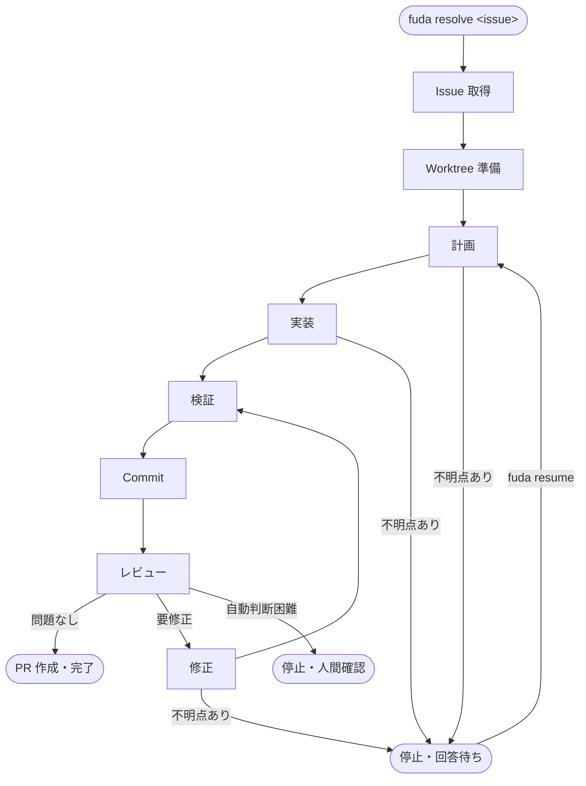

# Run のライフサイクル

`fuda resolve <issue>` を実行すると、Fuda は以下の順序で Issue を処理する。

## 通常フロー（happy path）

各フェーズの概要:

| フェーズ | 内容 |
|---|---|
| `loading_issue` | GitHub Issue の本文・コメントを取得する |
| `preparing_worktree` | Issue 専用の worktree と branch を作成する |
| `planning` | writer agent が実装計画を作成する |
| `writing` | writer agent が変更を実装する |
| `testing` | test / lint / typecheck を実行して検証する |
| `committing` | 変更を commit する |
| `reviewing` | reviewer agent が差分・テスト結果・受け入れ基準を検査する |
| `pr_created` | PR 作成済み。`run.json` に PR number / URL を記録した状態 |
| `succeeded` | Run が正常終了し、終了処理が完了した状態 |

## 主な分岐

- **修正ループ**: reviewer が修正必要と判断した場合、修正 → 検証 を繰り返す（上限あり）
- **回答待ち**: writer が不明点を検出した場合、Fuda は Issue に質問を投稿して停止する。`fuda resume` で再開できる
- **人間確認**: 修正ループ上限到達または自動判断が困難な場合、Fuda は停止して人間の判断を求める

各シナリオの詳細は [scenarios.md](scenarios.md) を参照。

完全な状態遷移図（`run_state` enum・異常系・再開ポリシーを含む）は [内部仕様: Run State Machine](../internal/state-machine.md) を参照。
